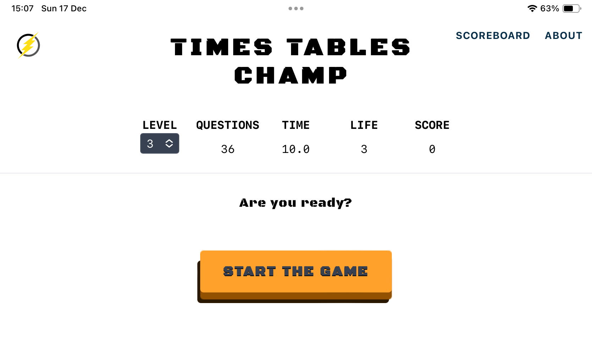

# Times Tables Champ




## 🚀 Welcome to our world of multiplication fun! 🚀
Hello, fellow math enthusiasts! We're Huseyin and Ahmed, a dynamic duo on a mission to make learning times tables an exciting adventure for young minds. Our journey began when we realised that traditional methods of memorizing multiplication facts were not as thrilling as they could be. So, we decided to embark on a quest to create our very own times tables game!

## 💥 The Spark of Creativity
It all started one day when Ahmed, our brilliant 7-year-old, expressed a desire to master times tables in a more interactive way. Instead of sticking to dull flashcards and rote memorisation, we put on our thinking caps and brainstormed ideas for a game that would make learning multiplication a joyous experience.

## 🎨 The Creative Process
Our living room became a brainstorming hub filled with whiteboard, markers, and endless laughter. We experimented with various game concepts, each aimed at making multiplication exciting and rewarding. We wanted our game to not only challenge young minds but also inspire a love for numbers.

## 🛠️ Building Blocks of the Game
As we delved into game development, Ahmed played a crucial role in deciding the look and feel of the game. From selecting button styles and colors to coming up with scoring logic and badges, every detail was a collaborative effort. We tested prototypes, found some bugs, fine-tuned mechanics, and celebrated small victories along the way.

## ✨ The Magic Unveiled
And here we are, presenting our creation to you – a game that makes learning times tables fun. Our hope is that children everywhere will find joy in solving multiplication problems, achieving new levels, and mastering the art of numbers.

## 🙌 Join Our Adventure!
We invite you to join us on this exciting journey of learning and discovery. Whether you're a parent looking for a fun way to reinforce math skills or a young explorer eager to conquer the world of multiplication, our game is designed for you!

## 🌟 Thank You for Being a Part of Our Story
A heartfelt thank you to everyone who encouraged us, played the early versions, and contributed to the creation of this game. If you find any problems or bugs, please feel free to report it and we'll get it fixed. Together, let's make learning math an adventure to remember!

Happy multiplying!
## Development
### Setup

Make sure to install the dependencies:

```bash
# npm
npm install
```

### Local Development Server

Start the development server on `http://localhost:3000`:

```bash
npm run dev
```

### Production

Build the application for production:

```bash
npm run generate
```

Locally preview production build:

```bash
npm run preview
```

### Deployment
Pushing changes to main branch are automatically deployed to production